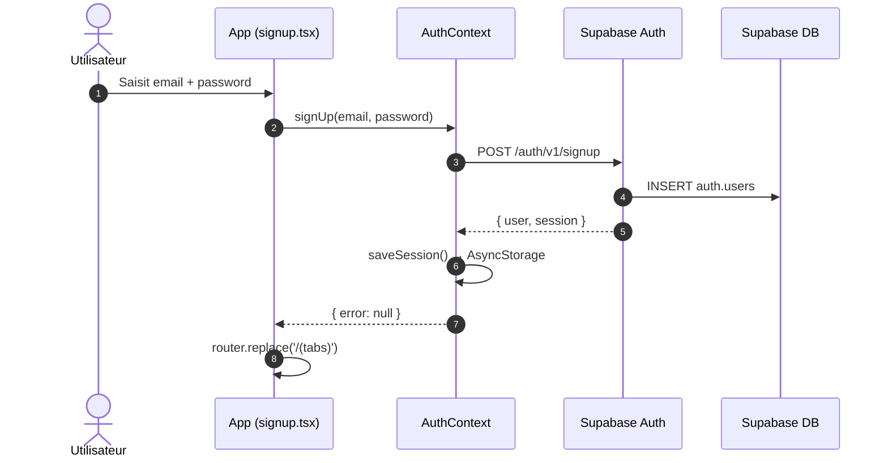
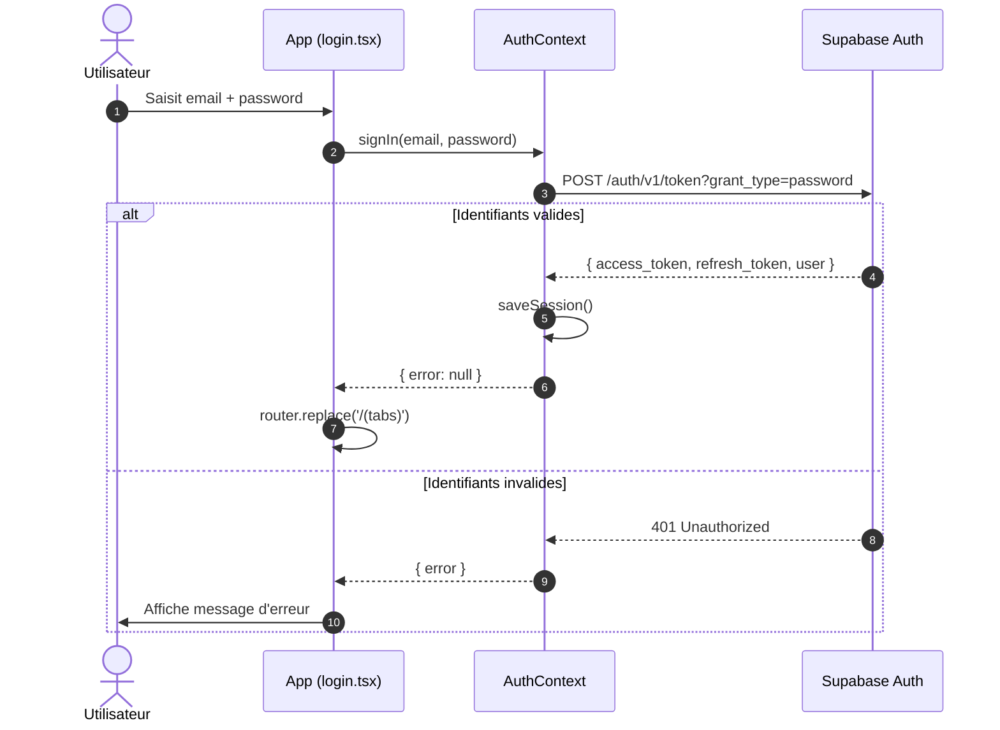
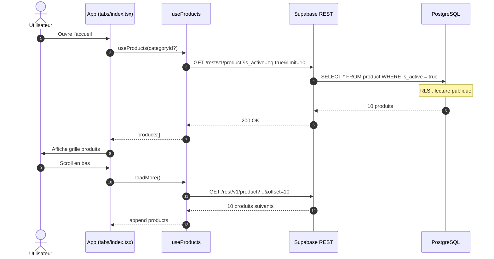
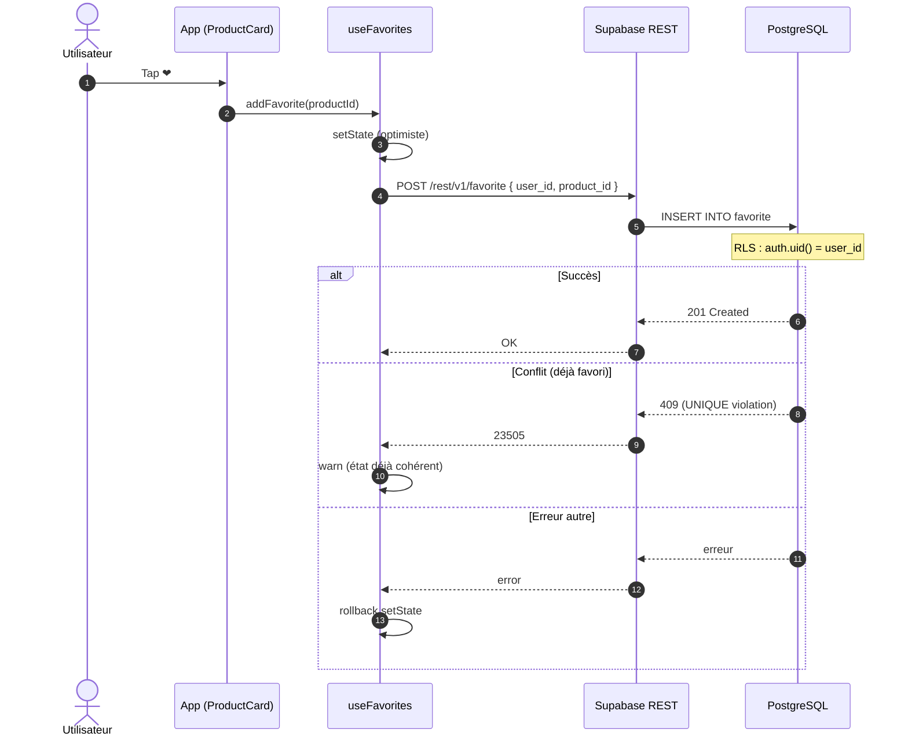
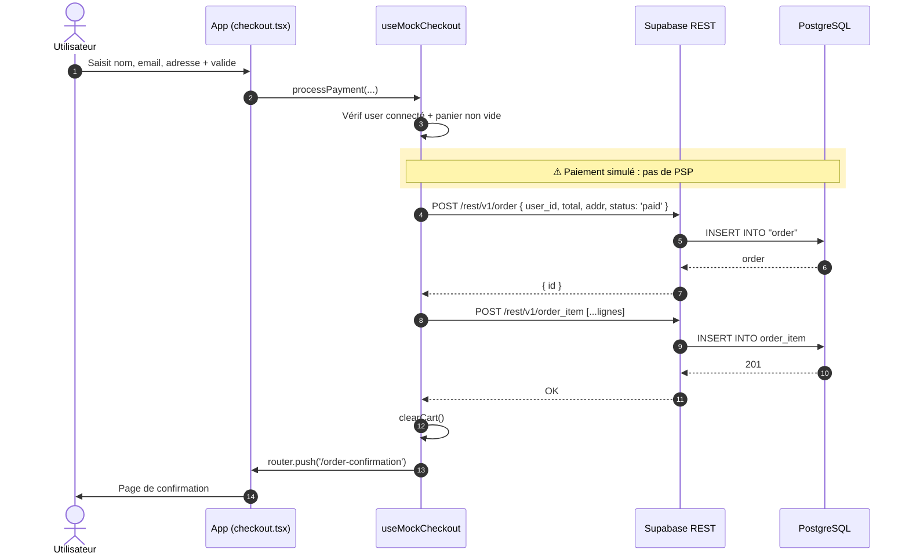
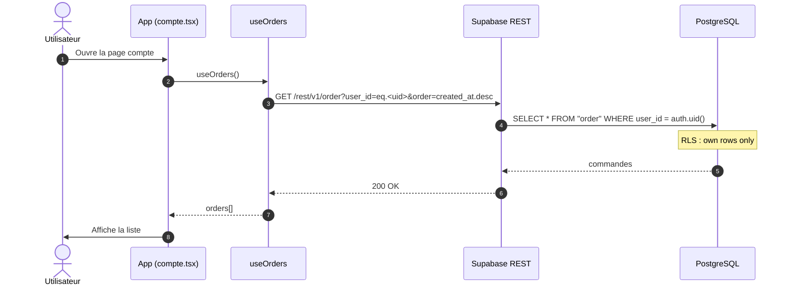

# Diagrammes de séquence — Leico

Diagrammes des principaux flux de l'application, en notation **Mermaid**
(rendu natif sur GitHub).

---

## 1. Inscription

---

## 2. Connexion

---

## 3. Liste produits + filtre catégorie

---

## 4. Ajout / suppression d'un favori

---

## 5. Checkout simulé (paiement mocké)

---

## 6. Affichage de l'historique des commandes

